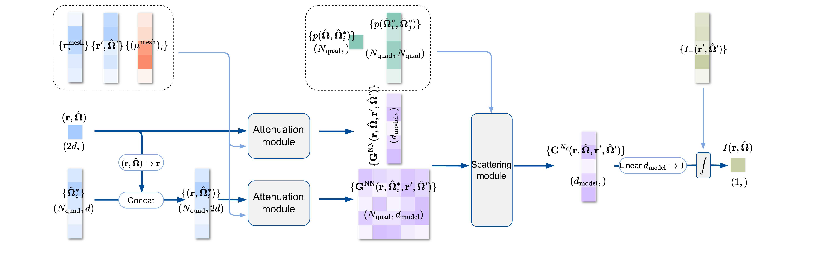

import { File, Folder, Files } from 'fumadocs-ui/components/files';



DeepRTE is a neural operator architecture designed to solve the Radiative Transfer Equation (RTE) in phase space. This repository provides code, configuration, and utilities for training, evaluating, and experimenting with DeepRTE models using provided RTE datasets.

Any publication that discloses findings arising from using this source code, the model parameters or outputs produced by those should [cite](#citing-this-work) the [DeepRTE: Pre-trained Attention-based Neural Network for Radiative Transfer](https://www.arxiv.org/abs/2505.23190) paper.

DeepRTE learns the solution operator:

$$
\mathcal{A}: (I_-; \mu_t, \mu_s, p) \to I,
$$

for the following steady-state radiative transfer equation:

$$
\Omega \cdot \nabla I(r,\Omega)+\mu_t(r)I(r, \Omega) = \frac{\mu_s (r)}{S^{d-1}}\int_{\mathbb{S}^{d-1}} p(\Omega,\Omega^*)I(r,\Omega^*)\,\mathrm{d}\Omega^*, \quad x\in D\subset\mathbb{R}^d,\; \Omega\in\mathbb{S}^{d-1},
$$

with the in-flow boundary condition:

$$
I(\mathbf{r},\mathbf{\Omega}) = I_{-}(\mathbf{r},\mathbf{\Omega}), \quad\text{on } \Gamma_{-} = \big\{(\mathbf{r},\mathbf{\Omega}) \mid \mathbf{n}_{\mathbf{r}}\cdot\mathbf{\Omega}<0 \big\}.
$$

## Installation

### 1. Clone the Repository

```bash title="Clone the Repository"
git clone https://github.com/mazhengcn/deeprte.git --branch v1.0.1
cd deeprte
```

or download directly from the [Release](https://github.com/mazhengcn/deeprte/releases)

### 2. Install Dependencies

This project uses [JAX AI Stack](https://github.com/jax-ml/jax-ai-stack) (JAX, Flax, Optax, Orbax, etc.). The recommended way to install dependencies is with [`uv`](https://github.com/astral-sh/uv):

```bash title="Install Dependencies"
uv sync
```

This installs all necessary dependencies, including the project itself. For NVIDIA GPU support, use:

```bash title="Install Dependencies with CUDA Support"
uv sync --extra cuda
```

For development, run:

```bash title="Install Development Dependencies"
uv sync --dev --all-extras
```

to install all development dependencies.

### 3. Container

A pre-built runtime container is available. To pull the latest image, run:

```bash title="Pull the Latest Image"
docker pull ghcr.io/mazhengcn/deeprte
```

Start the container with:

```bash title="Start the Container"
docker run -it --gpus=all --shm-size=1g ghcr.io/mazhengcn/deeprte /bin/bash
```

Alternatively, if you prefer to build the image yourself, use the provided [Dockerfile](./Dockerfile):

```bash title="Build the Image"
docker build -t deeprte .
```

#### Dev Container

For development, a [devcontainer](https://code.visualstudio.com/docs/devcontainers/containers) is provided to ensure a reproducible environment. Simply open the repository root in VSCode, and the container will be built automatically with all required dependencies, development tools, and data volume mounts. Python and its dependencies are managed by `uv`.

The devcontainer configuration files are located in the [.devcontainer/](./.devcontainer) directory and can be customized as needed.

## Datasets and Pretrained Models

### Download Datasets

Datasets for training and testing DeepRTE are generated using conventional numerical methods in MATLAB and Python. The source code is available in a separate repository: [rte-dataset](https://github.com/mazhengcn/rte-dataset). For more details, refer to that repository.

Inference (test) and pretraining datasets are hosted on Huggingface: https://huggingface.co/datasets/mazhengcn/rte-dataset. Download datasets to `DATA_DIR` with (ensure `huggingface-cli` is installed; if you followed the setup above, it is already included):

```bash title="Download Datasets"
huggingface-cli download mazhengcn/rte-dataset \
    --exclude=interim/* \
    --repo-type=dataset \
    --local-dir=${DATA_DIR}
```

The resulting folder structure should be (for inference, only datasets under `raw/test` are needed):

```files
DATA_DIR
├── processed
│   └── tfds      # Processed TFDS dataset for pretraining.
├── raw
│   ├── test      # Raw MATLAB dataset for test/inference.
│   └── train     # Raw MATLAB dataset for pretraining using grain.
└── README.md
```

### Download Pretrained Models

Pretrained models can be downloaded to `MODEL_DIR` from Huggingface:

```bash title="Download Pretrained Models"
huggingface-cli download mazhengcn/deeprte \
    --repo-type=model \
    --local-dir=${MODELS_DIR}
```

The folder structure will be:

```files
MODELS_DIR
├── README.md
├── v0                    # Pre-release version (deprecated).
├── v1                    # Pre-release version (deprecated).
└── v1.0.1                # Current release models for different scattering kernel ranges.
    ├── g0.1
    │   ├── config.json
    │   └── params
    ├── g0.5
    │   ├── config.json
    │   └── params
    └── g0.8
        ├── config.json
        └── params
```

A convenient shell script [scripts/download_dataset_and_models.sh](./scripts/download_dataset_and_models.sh) is provided to download datasets to [./data](./data/) and pretrained models to [./models](./models/):

```bash title="Download Datasets and Models"
uv run ./scripts/download_dataset_and_models.sh
```

## Run DeepRTE

To run DeepRTE inference:

```bash title="Run DeepRTE"
uv run run_deeprte.py --model_dir=${MODEL_DIR} --data_path=${DATA_PATH} --output_dir=${OUTPUT_DIR}
```

where `${MODEL_DIR}` is the pretrained model directory, `${DATA_PATH}` is the data path for inference, and `${OUTPUT_DIR}` is the directory to store results.

For example:

```bash title="Run DeepRTE"
DATA_PATH=${1:-"./data/raw/test/sin-rv-g0.5-amplitude5-wavenumber10/sin-rv-g0.5-amplitude5-wavenumber10.mat"}
MODEL_DIR=${2:-"./models/v1.0.1/g0.5"}
OUTPUT_DIR=${3:-"./outputs"}

TIMESTAMP="$(date --iso-8601="seconds")"

python run_deeprte.py \
  --model_dir="${MODEL_DIR}" \
  --data_path="${DATA_PATH}" \
  --output_dir="${OUTPUT_DIR}/${TIMESTAMP%+*}"
```

A shell script [./scripts/run_deeprte.sh](./scripts/run_deeprte.sh) containing above contents is also provided for convenience, you can modify it and run:

```bash title="Run DeepRTE"
uv run ./scripts/run_deeprte.sh
```

You can also run using the runtime container:

```bash title="Run DeepRTE"
docker run -it \
    --volume <DATA_PATH>:/deeprte/data/data_path \
    --volume <MODEL_DIR>:/deeprte/models \
    --volume <OUTPUT_DIR>:/deeprte/output \
    --gpus all \
    ghcr.io/mazhengcn/deeprte \
    python run_deeprte.py \
    --model_dir=/deeprte/models \
    --data_path=/deeprte/data \
    --output_dir=/deeprte/deeprte_output
```

## Train DeepRTE

To train DeepRTE from scratch, run:

```bash title="Train DeepRTE"
uv run run_train.py --config=${CONFIG_PATH} --workdir=${CKPT_DIR}
```

After training, checkpoints are saved under `${CKPT_DIR}`. To generate an inference checkpoint, run:

```bash title="Generate Inference Checkpoint"
uv run generate_param_only_checkpoint.py --train_state_dir=${TRAIN_STATE_DIR} --checkpoint_dir=${CKPT_DIR}
```

You can also modify and run the convenient scripts:

```bash title="Run Training Script"
uv run ./scripts/run_train.sh
```

```bash title="Generate Inference Checkpoint"
uv run ./scripts/generate_param_only_checkpoint.sh
```

## Citing This Work

Any publication that discloses findings arising from using this source code, the model parameters or outputs produced by those should cite:

```bibtex title="DeepRTE Citation"
@article{ZHU2026118556,
    title = {DeepRTE: Pre-trained attention-based neural network for radiative transfer},
    journal = {Computer Methods in Applied Mechanics and Engineering},
    volume = {449},
    pages = {118556},
    year = {2026},
    issn = {0045-7825},
    doi = {https://doi.org/10.1016/j.cma.2025.118556},
    url = {https://www.sciencedirect.com/science/article/pii/S004578252500828X},
    author = {Yekun Zhu and Min Tang and Zheng Ma},
    keywords = {Neural operator, Radiative transfer equation, Attention, Pre-training},
}
```

## Acknowledgements

DeepRTE's release was made possible by the contributions of the following people: Zheng Ma, Yekun Zhu, Min Tang and Jingyi Fu.

DeepRTE uses the following separate libraries and packages:

- [abseil-cpp](https://github.com/abseil/abseil-cpp) and
  [abseil-py](https://github.com/abseil/abseil-py)
- [clu](https://github.com/google/CommonLoopUtils)
- [Docker](https://www.docker.com)
- [Grain](https://github.com/google/grain)
- [Hugging Face](https://huggingface.co)
- [JAX](https://github.com/jax-ml/jax)
- [Flax](https://github.com/google/flax)
- [Optax](https://github.com/google-deepmind/optax)
- [NumPy](https://github.com/numpy/numpy)
- [Tensorflow](https://github.com/tensorflow/tensorflow)
- [uv](https://github.com/astral-sh/uv)

We thank all their contributors and maintainers!

## Get in Touch

If you have any questions not covered in this overview, please open an issue or contact the Zheng Ma at zhengma@sjtu.edu.cn.
