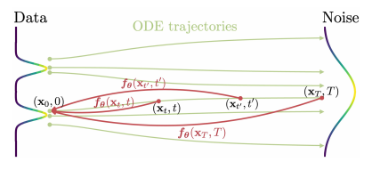

## 一致性模型（Consistency Models）：高效生成与蒸馏训练

本文由 OpenAI 的 Yang Song 等人于 2023 年发表在国际机器学习大会（ICML），提出了一致性模型（Consistency Models） 这一新型生成模型，旨在解决扩散模型（Diffusion Models）迭代采样速度慢的核心痛点，同时保留其高质量生成、计算与质量权衡、零样本编辑等优势，为图像、音频、视频生成领域提供了更高效的解决方案。

## 研究背景：扩散模型的优势与局限

扩散模型（也称基于分数的生成模型）是近年来生成式 AI 领域的核心技术，已在图像生成（如 Stable Diffusion）、音频合成（如 DiffWave）、视频生成（如 Imagen Video）等领域取得突破性成果，其核心优势包括：

- 高质量生成：通过迭代去噪过程，可生成细节丰富、真实度高的样本；
- 灵活的权衡性：额外迭代次数（计算成本）可换取更高样本质量；
- 零样本编辑能力：无需针对特定任务（如图像修复、上色）训练，即可解决逆问题（如 CT/MRI 图像重建、笔触引导编辑）。

但扩散模型存在显著局限 ——采样速度慢：其迭代生成过程通常需要 10-2000 次模型评估，相比生成对抗网络（GANs）、变分自编码器（VAEs）等单步生成模型，计算成本高 10-2000 倍，难以满足实时应用需求。

## 核心创新：一致性模型的定义与设计

## 核心思想：从概率流 ODE 到一致性映射

一致性模型的理论基础源于连续时间扩散模型的概率流 ODE（Probability Flow ODE）：

- 扩散模型的核心是 “数据→噪声” 的随机微分方程（SDE），而概率流 ODE 是其对应的确定性轨迹，可平滑地将数据分布转化为易处理的高斯噪声分布；
- 一致性模型的目标是学习一个映射函数：将概率流 ODE 轨迹上的任意时间步点(如带噪声的数据$x_t$)直接映射到轨迹的起点(即干净数据$x_0$)。

也就是说，对概率流ODE的一条解轨迹$\{x_t\}, t\in [\epsilon, T]$，定义一致性函数

$$
f:(x_t,t)\rightarrow x_\epsilon
$$

这个方法可以被视为只有一步的扩散过程，或者概率流ODE模型的算子学习求解

## 自一致性（Self-Consistency）

对于概率流 ODE 轨迹上的任意两点$(x_t,t)$和$(x_{t'},t')$（同一轨迹的不同时间步,其中$t,t'\in [\epsilon,T]$），一致性模型的输出必须满足

$$
f(x_t,t)=f(x_{t'},t')
$$

这种 “同一轨迹映射到同一起点” 的特性被称为自一致性，也是模型名称的由来。

## 模型参数化

一致性模型需满足边界条件：当时间步$t=\epsilon$（接近零的极小值，扩散模型的终点时刻）时，模型输出等于输入，

$$
f(x_\epsilon,\epsilon)=x_\epsilon
$$

相比通过训练保证这个性质的成立，CM方法通过类似残差的模型结构自然的引入这一边界条件，

$$
f_\theta(x, t) = c_{skip}(t) \cdot x + c_{out}(t) \cdot F_\theta(x, t)
$$

- $F_\theta(x, t)$是任意深度神经网络（如卷积网络、Transformer）；
- $c_{skip}(t)$和$c_{out}(t)$是关于$\mathbf{t}$的可微函数，且满足$c_{skip}(\epsilon)=1$、$c_{out}(\epsilon)=0$，以满足边界条件。
- 注意到在EDM模型中，模型$D(x_t,t)$被设计以预测$E[x_0|x_t]$，当$t=0$时同样是恒等映射，CM model的参数化机制正是在EDM的基础上做了微小的改动，实际实验中的设定是
- $$
  c_{\text{skip}}(t) = \frac{\sigma_{\text{data}}^2}{(t - \epsilon)^2 + \sigma_{\text{data}}^2}, \quad c_{\text{out}}(t) = \frac{\sigma_{\text{data}}(t - \epsilon)}{\sqrt{\sigma_{\text{data}}^2 + t^2}}
  $$

## 采样机制

文章提供了两种不同的采样方法：

1. 单步采样（快速生成）：从高斯噪声分布$N(0,\sigma_T^2\mathbf{I})$中采样初始噪声$x_T$，直接通过一次模型前向传播得到干净数据：$\hat{x}_0 = f_\theta(x_T, T)$，这种方法仅需1次神经网络评估，相对原来的扩散模型提升很多。
2. 多步采样（质量优化）：通过 “去噪 + 噪声注入” 的交替步骤，多次调用一致性模型以提升质量，算法流程如下：
   - 输入：一致性模型$f_\theta$、时间步序列$\tau_1>\tau_2>\dots>\tau_{N-1}$、$f_\theta$初始噪声$x_T$；
   - 迭代：先通过$f_\theta$去噪，再注入少量噪声以探索更优轨迹，最终输出高质量样本。该过程支持 “计算成本 - 样本质量” 的灵活权衡，与扩散模型的迭代逻辑兼容。

## 训练策略

一致性模型的文章提供了两种不同的训练方法，分别是从预训练的扩散模型（去噪分数匹配）中蒸馏信息的CD一致蒸馏方法和独立的CT一致性训练方法

## 蒸馏模式（Consistency Distillation, CD）：复用扩散模型知识

若已有预训练扩散模型，可通过蒸馏将其知识迁移到一致性模型，核心是利用概率流 ODE 轨迹的相邻点对，最小化模型输出的差异：

数据生成：通过预训练扩散模型的概率流 ODE，生成轨迹上的相邻点对

$$
(x_{t_{n+1}}, \hat{x}_{t_n}^\phi)
$$

损失函数：最小化相邻点对在一致性模型上的输出差异，确保自一致性：

$$
\mathcal{L}_{CD}^N(\theta, \theta^-; \phi) = \mathbb{E}\left[\lambda(t_n) \cdot d(f_\theta(x_{t_{n+1}}, t_{n+1}), f_{\theta^-}(\hat{x}_{t_n}^\phi, t_n))\right]
$$

其中：

- $\theta^-$是目标网络（通过指数移动平均 EMA 更新，稳定训练）；
- $d(\cdot,\cdot)$是度量函数（文中验证 LPIPS 最优，因更贴合图像感知相似度）；
- $\lambda(t_n)$是权重函数，平衡不同时间步的贡献。

这种方法无需从零训练，边界条件由模型结构保证，只需通过训练保证一致性，且相对原模型效率提升。

## 独立训练模式（Consistency Training, CT）：无需预训练扩散模型

若没有预训练扩散模型，可直接从数据中训练一致性模型，核心是利用分数函数的无偏估计替代预训练扩散模型：

- 基于Tweedie's formula，推导得到分数函数$\nabla \log p_t(x_t)$的解析形式：
- $$\nabla \log p_t(x_t) = -\mathbb{E}\left[\frac{x_t - x}{t^2} \mid x_t\right]$$
- 损失函数：直接利用干净数据与噪声数据对，最小化不同噪声水平下模型输出的差异：
- $$\mathcal{L}_{CT}^N(\theta, \theta^-) = \mathbb{E}\left[\lambda(t_n) \cdot d(f_\theta(x + t*{n+1}z, t*{n+1}), f\_{\theta^-}(x + t_nz, t_n))\right]$$

这种模式无需依赖预训练的扩散模型，并且结果被证实优于单步对抗模型

## 补充

如需进一步了解理论证明（如一致性蒸馏的渐近误差分析）、连续时间扩展（如连续时间损失函数），可参考原文附录 A 和 B。
