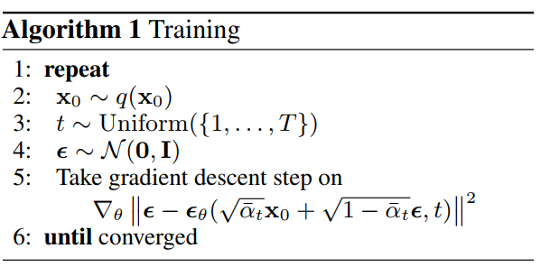
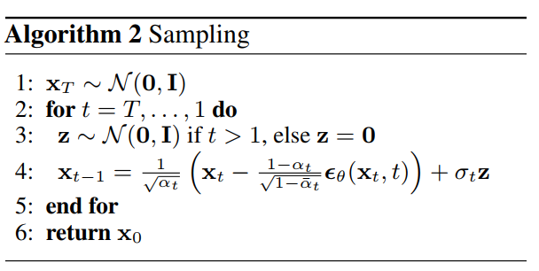
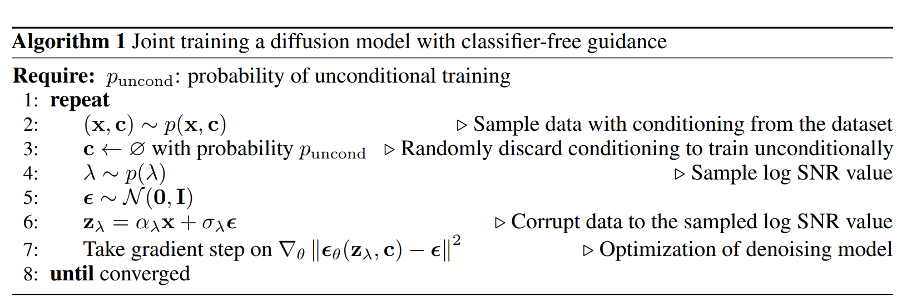
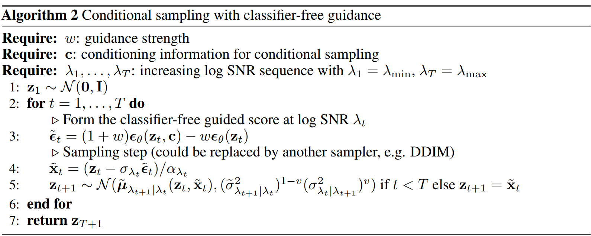

## DDPM

### 核心思想

将图片一步步加噪，最终得到近似纯噪声图片，再通过神经网络一步步去噪，得到原来的图片

### 主要公式

1. 加噪过程, 单步加噪：

   $$
   q(\mathbf{x}_t | \mathbf{x}_{t-1}) = \mathcal{N}(\mathbf{x}_t; \sqrt{1 - \beta_t} \mathbf{x}_{t-1}, \beta_t \mathbf{I})
   $$

2. 重参数化：

   $$
   \mathbf{x}_t = \sqrt{\bar{\alpha}_t} \mathbf{x}_0 + \sqrt{1 - \bar{\alpha}_t} \epsilon
   $$

   其中: $\alpha_t = 1 - \beta_t, \bar{\alpha}_t = \prod_{i=1}^{t} \alpha_i, \epsilon \sim \mathcal{N}(0, \mathbf{I})$

3. 去噪过程 1. 原始后验分布：

   $$
   q(\mathbf{x}_{t-1} | \mathbf{x}_0,\mathbf{x}_t) = \mathcal{N}(\mathbf{x}_{t-1}; \boldsymbol{\tilde\mu}(\mathbf{x}_t, \mathbf{x}_0), \tilde\beta_t\mathbf{I})
   $$

   其中$\boldsymbol{\tilde\mu}(\mathbf{x}_t, \mathbf{x}_0) = \frac{\sqrt{\bar\alpha_{t-1}}\beta_t}{1-\bar\alpha_t}\mathbf{x}_0+\frac{\sqrt{\alpha_t}(1-\bar\alpha_{t-1})}{1-\bar\alpha_t}\mathbf{x}_t,\ \tilde\beta_t:=\frac{1-\bar\alpha_{t-1}}{1-\bar\alpha_t}\beta_t$ 1. 近似后验分布：

   $$
   p_\theta(\mathbf{x}_{t-1} | \mathbf{x}_t) = \mathcal{N}(\mathbf{x}_{t-1}; \boldsymbol{\mu}_\theta(\mathbf{x}_t, t), \boldsymbol{\Sigma}_\theta(\mathbf{x}_t, t))
   $$

   DDPM中直接令$\boldsymbol{\Sigma}_\theta(\mathbf{x}_t, t))=\tilde\beta_t\mathbf{I}$（取$\beta_t$效果类似）

4. 损失函数：
   $$
   L =  \mathbb{E}_{t, \mathbf{x}_0, \epsilon} \left[ \| \epsilon - \epsilon_\theta( \sqrt{\bar{\alpha}_t} \mathbf{x}_0 + \sqrt{1 - \bar{\alpha}_t} \epsilon, t ) \|^2 \right]
   $$
5. 采样流程：
   $$
   \mathbf{x}_{t-1} = \frac{1}{\sqrt{\alpha_t}} \left( \mathbf{x}_t - \frac{1 - \alpha_t}{\sqrt{1 - \bar{\alpha}_t}} \epsilon_\theta(\mathbf{x}_t, t) \right) + \sigma_t \mathbf{z}
   $$
   其中，$\mathbf{z} \sim \mathcal{N}(0, \mathbf{I}) , t > 1, \sigma_t^2 = \beta_t$(结果与$\tilde\beta_t$类似）

### 算法流程

1. 训练流程

1. 采样流程

其中$\beta_t$是从0.0001到0.02线性增加的

### 对DDPM的改进

1.  改进对数似然：1. 学习方差：

    $$
    \Sigma_\theta(x_t, t) = \exp(v \log \beta_t + (1 - v) \log \tilde{\beta}_t)
    $$

    其中$v$是模型的输出向量，相应的损失函数修改为：

    $$
    L_{\text{hybrid}} = L_{\text{simple}} + \lambda L_{\text{vlb}}
    $$

    其中$L_{\text{simple}}$为DDPM的损失函数，$L_{\text{vlb}}$为变分下界（variational low bound, VLB) $\lambda=0.001$, 训练时采用重要性采样：

    $$
    L_{\text{vlb}} = \mathbb{E}_{t \sim p_t} \left[ \frac{L_t}{p_t} \right],\
    p_t \propto \sqrt{\mathbb{E}[L_t^2]}
    ,\ \sum p_t = 1
    $$

    由于真实的 $\mathbb{E}[L_t^2]$ 是未知且随着训练动态变化的，这里为每个时间步$t$维护一个最近 10 个$L_t$值的队列。在训练过程中，他们持续计算每个 $t$的 $\mathbb{E}[L_t^2]$ 的移动平均，并据此更新采样概率$p_t$。在训练刚开始时，先进行一段时间的均匀采样，以收集足够的初始数据来估计各个$p_t$。

    $L_{\text{vlb}}$的计算公式如下：

    $$
    L_{\text{vlb}} = \sum\limits_{t=0}^{T}L_t
    $$

    $$
    L_{0} = -\log p_\theta(x_0|x_1)
    $$

    $$
    L_{t-1} = D_{KL}(q(x_{t-1}|x_t, x_0) \| p_\theta(x_{t-1}|x_t))
    $$

    $$
    L_T = D_{KL}(q(x_T|x_0) \| p_\theta(x_T))
    $$

实际训练时由于所有的分布均为高斯分布，因此采用如下公式计算KL散度

$$
D_{KL}(\mathcal{N}(\mu_1, \sigma_1^2) \| \mathcal{N}(\mu_2, \sigma_2^2)) = \frac{1}{2} \left[ \log\frac{\sigma_2^2}{\sigma_1^2} + \frac{\sigma_1^2}{\sigma_2^2} + \frac{(\mu_1 - \mu_2)^2}{\sigma_2^2} - 1 \right]
$$

实际训练时可以直接把UNet的输出通道数×2即可

2. 改进噪声调度，原始论文噪声调度为线性增长，该论文修改为：
   $$
   \bar{\alpha}_t = \frac{f(t)}{f(0)},f(t) = \cos\left(\frac{t/T + s}{1 + s} \cdot \frac{\pi}{2}\right)^2
   $$
   这种采样方式更适合低分辨率图像
3. 提高采样频率
   $S_t$为$\{1,\cdots,T\}$的一个子集，只在该子集上做sample，相应的方差值修改如下

   $$
   \beta_{S_t} = 1 - \frac{\bar{\alpha}_{S_t}}{\bar{\alpha}_{S_{t-1}}}
   $$

   $$
   \tilde{\beta}_{S_t} = \frac{1 - \bar{\alpha}_{S_{t-1}}}{1 - \bar{\alpha}_{S_t}} \beta_{S_t}
   $$

   再通过学习的$\Sigma_\theta(x_{S_t},S_t)$做相应的插值

4. 增加模型大小，多训练几轮能提高模型的表现
5. 对模型的改进方向（来源于 [beat GANs](https://s0lu5lblzl4.feishu.cn/record/Jo6prUwpzeGUcyc8JZwcvLt5nzy))
   1. <b>更宽的模型</b>能更快地收敛并达到更优的FID <b>（即更大的通道数）</b>。更深的模型<b>（即堆叠更多的残差块）</b>也能有好的性能，但训练所需的时间更长。资源不足的前提下优先选择增加模型的通道数
   2. attention：对$8\times 8, 16\times 16, 32\times 32$的图像都使用了attention机制，维数为通道数，序列长度为$h\times w$。使用多头注意力机制，把每个头的通道数固定为64
   3. 借鉴BigGAN：
      1. BigGAN的块通常包含一个平均池化层来减小分辨率，同时在残差连接（skip connection）上也进行相应的下采样。
      2. BigGAN的块先用简单的插值（如最近邻插值）放大特征图，然后再进行卷积操作。
   4. 自适应组归一化 Adaptive Group Normalization (AdaGN)：修改label和时间t的注入方式，计算公式为
      $$
      AdaGN(h, y_{emb}) = y_s * GroupNorm(h) + y_b
      $$
      其中h为每个残差块第一个卷积后的特征图，$y_{emb}$是由条件和时间嵌入拼接而成的条件向量。通过一个线性层将其投影成 $y_s, y_b$，然后做上述仿射变换。

## DDIM

### 核心思想

训练DDPM使用重参数技巧，训练目标只依赖于边缘分布$q(\mathbf{x}_t|\mathbf{x}_0)$, 而不依赖联合分布的具体形式，因此本文设计了一族非马尔可夫前向过程，保证重参数化下$\mathbf{x}_t$的分布不变，对采样过程进行了修改

## 前向过程

将DDPM中的马尔可夫过程

$$
q(\bm{x}_{1:T}|\bm{x}_{0}):=\prod_{t=1}^{T}q(\bm{x}_{t}|\bm{x}_{t-1}),\text{ where }q(\bm{x}_{t}|\bm{x}_{t-1}):=\mathcal{N}\left(\sqrt{\alpha_{t}}\bm{x}_{t-1},\left(1-\alpha_{t}\right)\bm{I}\right)
$$

修改为如下的非马尔可夫过程

$$
q_{\sigma}(\bm{x}_{1:T}|\bm{x}_{0}):=q_{\sigma}(\bm{x}_{T}|\bm{x}_{0})\prod_{t=2}^{T}q_{\sigma}(\bm{x}_{t-1}|\bm{x}_{t},\bm{x}_{0})
$$

其中的条件分布满足

$$
q_{\sigma}(\bm{x}_{t-1}|\bm{x}_{t},\bm{x}_{0})=\mathcal{N}\left(\sqrt{\alpha_{t-1}}\bm{x}_{0}+\sqrt{1-\alpha_{t-1}-\sigma_{t}^{2}}\cdot\frac{\bm{x}_{t}-\sqrt{\alpha_{t}}\bm{x}_{0}}{\sqrt{1-\alpha_{t}}},\sigma_{t}^{2}\bm{I}\right)
$$

此时仍然<b>满足之前重参数技巧后的式子</b>

$$
\bm{x}_{t}=\sqrt{\alpha_{t}}\bm{x}_{0}+\sqrt{1-\alpha_{t}}\epsilon,\quad\text{where}\quad\epsilon\sim\mathcal{N}(\bm{0},\bm{I})
$$

因此可以直接使用DDPM训练得到的模型

### 逆向过程

1. 采样公式

   $$
   \bm{x}_{t-1}=\sqrt{\bar\alpha_{t-1}}\left(\frac{\bm{x}_{t}-\sqrt{1-\bar\alpha_{t}}\epsilon_{\theta}(\bm{x}_{t},t)}{\sqrt{\bar\alpha_{t}}}\right)+\sqrt{1-\bar\alpha_{t-1}-\sigma_{t}^{2}}\cdot\epsilon_{\theta}(\bm{x}_{t},t)+\sigma_{t}\epsilon_{t}
   $$

   前一项用于预测$\mathbf{x}_0$，后一项用于引导噪声方向

2. 特殊情况：当$\sigma_t$取0时，可以得到完全确定性的采样过程
3. 加速采样：考虑$\{\mathbf{x}_t,t=1,2,\cdots,T\}$的一个子集$\{\mathbf{x}_{\tau_i},i=1,2,\cdots,S\},S<<T,q(\mathbf{x}_{\tau_i}|\mathbf{x}_0)=\mathcal{N}(\sqrt\alpha_{\tau_i}\mathbf{x}_0,(1-\alpha_{\tau_i})\mathbf{I}),$只需要将上面的$\alpha_{t-1}$修改成$\alpha_{\tau_{i-1}}$即可得到完整的采样公式
4. 和VE-SDE的关系：采样过程为如下ODE的离散形式：
   $$
   \frac{d\bar{x}(t)}{dt} = \frac{d\sigma(t)}{dt} \cdot \epsilon\_{\theta} \left( \frac{\bar{x}(t)}{\sqrt{\sigma^2(t) + 1}} ,t\right)
   $$
   其中，$\bar{x}(t) = \frac{x(t)}{\sqrt{\alpha(t)}}, \quad \sigma(t) = \sqrt{\frac{1 - \alpha(t)}{\alpha(t)}}$

## 条件采样

### 引导器指导采样

1. 目标：通过增加一个分类器（即下文中的$p_\phi$也是用神经网络训练的），来得到指定类别的图片（此时训练好的diffusion model无需再添加其他输入，<b>无需重新训练</b>）
2. 对于DDPM，条件采样分布，由Bayes公式

   $$
   p_{\theta,\phi}(x_t | x_{t+1}, y) \approx Z \cdot p_\theta(x_t | x_{t+1}) \cdot p_\phi(y | x_t)
   $$

   其中Z为归一化参数，再通过对数似然的泰勒展开，可得修正后的均值：

   $$
   \hat{\mu} = \mu_\theta(x_t, t) + \Sigma \cdot \nabla_{x_t} \log p_\phi(y | x_t)
   $$

   其中 $\Sigma$ 是方差矩阵。再添加缩放因子后可以得到:

   $$
   \hat{\mu} = \mu_\theta(x_t, t) + s \cdot \Sigma \cdot \nabla_{x_t} \log p_\phi(y | x_t)
   $$

3. 对于DDIM，定义score function:

$$
\nabla_{x_t} \log p_\theta(x_t) = -\frac{1}{\sqrt{1 - \bar{\alpha}\_t}} \epsilon_\theta(x_t,t)
$$

联合分布的score function为：

$$
\nabla_{x_t} \log [p_\theta(x_t) p_\phi(y | x_t)] = -\frac{1}{\sqrt{1 - \bar{\alpha}\_t}} \epsilon_\theta(x_t,t) + \nabla_{x_t} \log p_\phi(y | x_t)
$$

因此有修正后的噪声预测：(添加了缩放因子s）

$$
\hat{\epsilon}(x_t) = \epsilon_\theta(x_t) - s\cdot\sqrt{1 - \bar{\alpha}\_t} \cdot \nabla_{x_t} \log p_\phi(y | x_t)
$$

4. 注：上述的无条件模型也可以改成有条件的模型，有<b>条件模型+引导器指导采样</b>的图片效果最好

### 无引导器采样（CFG）

> 论文见 [CFG](https://s0lu5lblzl4.feishu.cn/record/CAturUIKveC8NAcvZFIcBF7nnrb)， [CFG++](https://s0lu5lblzl4.feishu.cn/record/JEz3r6AuzeRGHIcqG6TcQpyqnt3)

1.  核心算法：1. 训练算法：使用同一个神经网络模型来同时学习条件和无条件生成，在训练的每个步骤中，以一定的概率 $p_{uncond}$（例如10%或20%）<b>随机丢弃</b>条件信息 c，修改为空符号。目标函数保持不变，具体的流程如下：
     1. 采样算法：同时计算条件预测和无条件预测，然后将原来的预测噪声部分修改为

    $$
    \bar\epsilon_t=(1+w)\epsilon_{cond}-w\epsilon\_{uncond}
    $$

    其中$w$为超参，设置越高越能生成符合条件的图像。完整的算法流程如下：
    

2.  核心公式的推导：

    $$
    \bar\epsilon_t=(1+w)\epsilon_{cond}-w\epsilon\_{uncond}
    $$

    推导从上面给的引导器采样开始，我们有如下公式：

    $$
    \nabla_{z_\lambda} \log \tilde{p}(z_\lambda|c) = \nabla_{z_\lambda} \log p(z_\lambda|c) + w \cdot \nabla_{z_\lambda} \log p_\phi(c|z_\lambda)
    $$

    由score function和神经网络输出的转化关系我们有如下式子

    $$
      \tilde{\epsilon}_\theta(z_\lambda, c) = \epsilon_\theta(z_\lambda, c) - w\sigma_\lambda \nabla_{z_\lambda} \log p_\phi(c|z_\lambda)
    $$

    我们想要替换外部分类器，由贝叶斯公式再求对数梯度，我们有

    $$
    \nabla_{z_\lambda} \log p(c|z_\lambda) = \nabla_{z_\lambda} \log p(z_\lambda|c) - \nabla_{z_\lambda} \log p(z_\lambda)
    $$

    再由score function和神经网络输出的转化关系即可得到核心公式(32)
