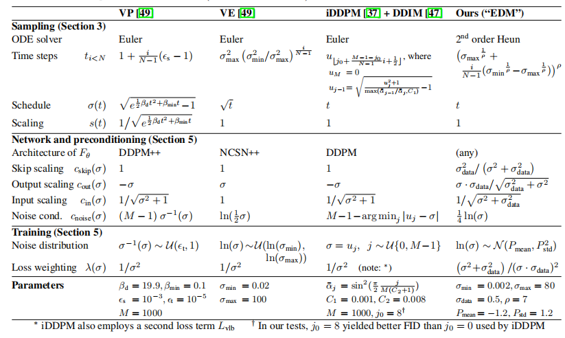

## 前言——扩散模型的历史

在这篇笔记中，我们介绍提出了扩散模型的统一框架的两篇文章之一，NVIDIA的[Elucidating the Design Space of Diffusion-Based Generative Models](https://s0lu5lblzl4.feishu.cn/record/Drhfr4ytJeXBT8cq5ElchHVGnQf)关于扩散模型与其衍生出的流模型的解释

## 扩散模型要解决的问题

通常对给定的某个感兴趣的分布中采样的部分样本，人类需要从中学习未知分布的信息并尝试从未知分布中采样新的样本，生成式模型被设计以解决这一类问题，这类方法在语言，图像，影像，音频等领域得到大量的发展与应用。变分自编码器，对抗生成网络，扩散模型及其变体都属于这一类别。

这类模型均涉及通过逐渐增强的噪声对训练数据进行成序破坏，随后学习逆转这种破坏过程，进而构建数据的生成模型。早期两类有影响力的发表工作分别是：基于朗之万动力学的得分匹配[Score Matching with Langevin Dynamics](https://s0lu5lblzl4.feishu.cn/record/Jkemrs7oue7t8Jc5BshcHZV6nZf), SMLD会在每个噪声尺度下估计得分（即对数概率密度相对于数据的梯度），之后在生成阶段利用朗之万动力学，从噪声尺度逐渐降低的序列中进行采样；以及去噪扩散概率建模[Denoising Diffusion Probabilistic Modeling](https://s0lu5lblzl4.feishu.cn/record/Lmg8r8fr3e62lbcWnZLcPWj9nHf)，DDPM则训练一系列概率模型来逆转噪声破坏的每一步，并借助反向分布的函数形式相关知识，使训练过程具备可处理性。在连续状态空间中，DDPM 的训练目标会隐式地计算每个噪声尺度下的得分。因此，这两类模型可以统称为基于得分的生成模型。

## 扩散模型的提出与发展

扩散模型的原型最早在2015年的[Deep Unsupervised Learning using Nonequilibrium Thermodynamics](https://s0lu5lblzl4.feishu.cn/record/EV33rdPsgeETQicwZOpcUSHWnKb)中提出，2020年在[Denoising Diffusion Probabilistic Models](https://s0lu5lblzl4.feishu.cn/record/Lmg8r8fr3e62lbcWnZLcPWj9nHf)将扩散模型应用于图像生成领域，并取得了在当时看来相当可观的成功，扩散模型逐渐成为图像生成方向的主流方法。

由DDPM作为起点，扩散模型发展出了针对不同性能优化的各种变体，其中比较具有影响力的是同年提出的[Denoising Diffusion Implicit Models](https://s0lu5lblzl4.feishu.cn/record/FM66r0htyegXFic5R7Xc8i9lnJd)以及2021年提出的[Improved Denoising Diffusion Probabilistic Models](https://s0lu5lblzl4.feishu.cn/record/BNpTrY1bqeIRkZc3UsWctOTjnae) ，分别给出了在更短时间下生成更高质量图像的确定性采样方法、可优化的方差参数和改进的schedule设计。

另一方面，在条件生成方向，有[Diffusion Model Beats GAN on Image Synthesis](https://s0lu5lblzl4.feishu.cn/record/Jo6prUwpzeGUcyc8JZwcvLt5nzy)，[Classifier-free Diffusion Guidance](https://s0lu5lblzl4.feishu.cn/record/CAturUIKveC8NAcvZFIcBF7nnrb)两篇工作，分别提出了以额外的训练器指导条件生成过程中的梯度，以及基于条件分数与无条件分数的联系设计无需分类器梯度引导的条件生成方法。

然而，这些众多关于扩散模型的工作，尽管不同的方法分别改进了图像质量，生成速度，训练成本在内的各种性能，但这些工作通常以一个整体的结构形式被发表，而单一组件如何被改进以及其造成的影响却没有得到充分的讨论。扩散模型的统一框架在[Score-Based Generative Modeling Through Stochastic Differential Equations](https://s0lu5lblzl4.feishu.cn/record/ICzMrKgK1evr7CcYx9gc9Qwmnyc)这篇文章中才被提出，[Elucidating the Design Space of Diffusion-Based Generative Models](https://s0lu5lblzl4.feishu.cn/record/Drhfr4ytJeXBT8cq5ElchHVGnQf)采用近似但略有不同的角度阐释了整个过程的机理，并提出了扩散模型设计空间的选择和一些高效的设计选择。两篇文章提出了涵盖其他有影响力的变体的统一框架，并给出了确定性采样方法概率流模型的推导。

我们这篇note将会逐一解释EDM的理论部分，对设计空间感兴趣的同学可以自己去阅读原文章。

## 基础知识

### 数据分布与含噪分布

我们用 $p_{\text{data}}(x)$表示数据的分布，其具有$\sigma_{\text{data}}$的标准差。

我们考虑在数据分布上添加水平为$\sigma$的独立高斯噪声得到的含噪分布，平滑分布族$p(x,\sigma)$满足

$$
p(x,\sigma) = \left(p_{\text{data}} * \mathcal{N}(0, \sigma^2 I)\right)(x)
$$

对于$\sigma_{\text{max}}\geq\sigma_{\text{data}}$，高斯噪声水平远大于数据标准差的情形，$p(x,\sigma)$与纯高斯噪声是基本上相同的。

## 扩散模型的基本思想

当我们需要从一个未知分布中采样，却只有采样自这个未知分布的若干样本$x_{1},x_{2},\cdots,x_{n}$时，该怎么设计一个算法满足采样的需求？

事实上，如果直接去优化生成样本到这些采样数据的距离，通过变分可以发现最优解只是这些样本的加权均值，而不一定在需要的数据分布之中

$$
\theta^{*} =\argmin_{\theta} \sum_{i=1}^{n}c_{i}||f(\theta)-x_{i}||^{2}
$$

$$
f(\theta^{*}) =\sum_{i=1}^{n}\frac{c_{i}}{\sum_{j=1}^{n}c_{j}}x_{i}
$$

为了从有限的采样样本中学习分布的信息，我们必须从分布的角度出发。扩散模型的基本思想是，设计一个随时间演化的过程$A_{t}$，使得在$t_{1}$时刻服从$p(x,\sigma_{t_{1}})$分布的变量经过演化,在$t_{2}$时刻恰好服从$p(x,\sigma_{t_{2}})$分布。

$$
x\sim p(x,\sigma_{t_{1}})
\implies
A_{t_{1}\rightarrow t_{2}}(x)\sim p(x,\sigma_{t_{2}})
$$

扩散模型的过程相当于逐步从含噪分布中降低噪音水平，当输入从$x_{0}\sim N(0,\sigma_{max}^{2}I)$中随机采样一个噪声图像，然后将其依次去噪得到$\sigma_{max}>\sigma_{1}>\cdots>\sigma_{N}=0$噪声水平的图像，使得在每个噪声水平下$x_{i}\sim p(x,\sigma_{i})$。因此，这个过程的终点的分布与数据分布一致，而初始的采样在$\sigma_{t_{max}}$充分大时可以替换为高斯噪声的采样。

# 采样过程的详细推导

## Fokker-planck方程

为了研究分布在微分方程下的演化，我们需要引入统计物理的工具Fokker-Planck方程，在微观和介观的实际物理系统中，粒子的运动往往存在大量的随机因素和复杂的相互作用，难以对每个粒子的运动进行详细描述，更实际有效的方法是研究粒子的速度和位置服从的分布，从微观粒子的行为出发推导出宏观系统的性质。

Fokker-Planck方程描述了系统状态的概率分布随时间的演化，对一般的$N$维SDE

$$
\mathrm{d}x=f(x,t)\,\mathrm{d}t+g(x,t)\,\mathrm{d}w_{t}
$$

其解服从的分布的概率密度$r(x,t)$随时间的演化服从以下方程

$$
\frac{\partial r(x, t)}{\partial t} = - \sum_{i=1}^{N} \frac{\partial}{\partial x_i} \left[f_i(x, t)r(x, t)\right] + \sum_{i=1}^{N} \sum_{j=1}^{N} \frac{\partial^2}{\partial x_i \partial x_j} \left[D_{ij}(x, t)r(x, t)\right]
$$

其中

$$
D_{ij}(x, t) = \frac{1}{2} \sum_{k=1}^{N} g_{ik}(x, t)g_{jk}(x, t).
$$

我们只需要$g(x,t):=g(t)\mathbf{I}$情况下这个方程的简化形式

$$
\frac{\partial r(x, t)}{\partial t} = - \nabla_{x}\cdot(f(x,t)r(x,t))+\frac{1}{2}g^{2}(t)\Delta r(x,t)
$$

## 含噪分布概率密度的演化

为了完成从未知分布中采样的任务，我们现在只需要设计一个随机微分方程，它的Fokker-planck形式满足含噪分布的演化性质，为此我们必须先探究$p(x,\sigma)$满足的性质，记$q(x,t)=p(x,\sigma(t))$，回到前面的定义，我们有

$$
q(x,t) = (p_{\text{data}} * \mathcal{N}(0, \sigma^2(t) I))(x)
$$

它的演化由扩散方程描述

$$
\frac{\partial q(x, t)}{\partial t} = \kappa(t)\Delta_x q(x,t)
$$

考虑$q(x,t)$在空间维度上的傅里叶变换$\hat{q}(v,t)$，由傅里叶变换的性质：

$$
\frac{\partial q(v, t)}{\partial t} = -\kappa(t)|v|^2\Delta_v q(v,t)
$$

$$
\hat{q}(v,t)=\hat{p}_{\text{data}}(v)\exp(-\frac{1}{2}|v|^{2}\sigma^2(t))
$$

对等式左右侧关于$t$微分

$$
\frac{\partial \hat{q}(\nu, t)}{\partial t} = - \dot{\sigma}(t)\sigma(t) |\nu|^2 \hat{p}_{\text{data}}(\nu) \exp\left(-\frac{1}{2} |\nu|^2 \sigma(t)^2\right)
=- \dot{\sigma(t)}\sigma(t) |\nu|^2 \hat{q}(\nu, t)
$$

知

$$
\frac{\partial q(x, t)}{\partial t} = \dot{\sigma}(t)\sigma(t)\Delta_x q(x,t)
$$

## 扩散过程满足的SDE形式

结合以上两个子单元，只需要设计一个SDE，它的Fokker-Planck方程形式满足3.2节推导的形式，也就是

$$
\begin{equation}
- \nabla_{x}\cdot(f(x,t)q(x,t))+\frac{1}{2}g^{2}(t)\Delta q(x,t)= \dot{\sigma}(t)\sigma(t)\Delta_x q(x,t)
\end{equation}
$$

$$
\nabla_{x}\cdot(f(x,t)q(x,t))=[\frac{1}{2}g^{2}(t)-\dot{\sigma}(t)\sigma(t)]\Delta_x q(x,t)
$$

实际上，只需要取$f(x,t)$使得

$$
f(x,t)q(x,t)=[\frac{1}{2}g^{2}(t)-\dot{\sigma}(t)\sigma(t)]\nabla_x q(x,t)
$$

为此可以导出

$$
f(x,t)=[\frac{1}{2}g^{2}(t)-\dot{\sigma}(t)\sigma(t)]\nabla_x \log{q(x,t)}
$$

我们称出现在等式右端的这项 似然函数的梯度 为分数(score function)，由此我们得到一族随机微分方程满足作为生成式模型的条件

$$
\mathrm{d}x=[\frac{1}{2}g^{2}(t)-\dot{\sigma}(t)\sigma(t)]\nabla_x \log{p(x,\sigma(t))}\,\mathrm{d}t+g(t)\,\mathrm{d}w_{t}
$$

输入高斯噪声，通过这个随机微分方程在$t_{max}\rightarrow t_{min}=0$上的演化，输出的样本将服从分布$p(x,\sigma(t_{min}))$，从而完成在未知分布中采样的任务。

## 概率流ODE模型

在3.3节的讨论中，通过理论推导了满足平滑分布族$p(x,\sigma(t))$演化条件的随机微分方程族，注意到当$g(t)=0$时，整个随机微分方程退化为一个常微分方程

$$
\mathrm{d}x=[-\dot{\sigma}(t)\sigma(t)]\nabla_x \log{p(x,\sigma(t))}\,\mathrm{d}t
$$

其轨迹与随机微分方程具有相同的边际概率密度，同样能够应用在生成任务中，同时因为其确定性采样的性质，能够被应用在许多扩散模型的进一步[应用](/docs/inverse/fwi/generative-models/Diffusion-Posterior-Sampling-DPS)算法中。

相对于随机微分方程的“去噪”作用，概率流ODE模型的演化同样使得样本分布的含噪水平逐步下降，但需要指出这两种方法的去噪作用都是针对分布的含噪水平的，而非单个样本上固定噪声水平的下降，概率流ODE模型可以被理解为SDE的一条“综合的轨迹”，具有与SDE相同的边际分布。

## 去噪分数匹配

### Tweedie's formula

基于第三单元的讨论，我们已经推导出了满足生成性质的微分方程形式，现在唯一的问题是如何对任意的二元组$(x,\sigma(t))$计算分数$\nabla_x \log p(x,\sigma(t))$。对给定的噪声水平$\sigma(t)$，这个向量场作为似然函数的梯度，自然的指向数据密度更高的区域。

实际上，对由独立高斯噪声和数据分布加和得到的求噪分布，score function有更一般的形式，我们对数据分布的简单形式给出推导，对更一般的连续分布形式，将以下推导中的求和改为全空间上对数据密度的积分，结论与推导过程依然成立。

假设数据集由有限个样本 $x_{1},x_{2},\cdots,x_{n}$组成，数据分布有以下形式

$$
p_\text{data}(x) = \frac{1}{n}\sum_{i=1}^{n}\delta(x-x_{i})
$$

根据 $p(x,\sigma) = p_\text{data} \ast N(0,\sigma^{2}I)$，将 $p_{data}$的表达式代入可得：

$$
\begin{split}
p(x,\sigma) &= p_\text{data} \ast N(0,\sigma^{2}I)
\\
&=\int_{R^{d}}p_\text{data}(x_{0})N(x;x_{0},\sigma^{2}I)\,dx_{0}\\
&=\int_{R^{d}}[\frac{1}{n}\sum_{i=1}^{n}\delta(x_{0}-x_{i})]N(x;x_{0},\sigma^{2}I)\,dx_{0}\\
&=\int_{R^{d}}[\frac{1}{n}\sum_{i=1}^{n}\delta(x_{0}-x_{i})]N(x;x_{0},\sigma^{2}I)\,dx_{0}\\&=\int_{R^{d}}[\frac{1}{n}\sum_{i=1}^{n}\delta(x_{0}-x_{i})]N(x;x_{0},\sigma^{2}I)\,dx_{0}\\&=\frac{1}{n}\sum_{i=1}^{n}\int_{R^{d}}N(x;x_{0},\sigma^{2}I)\delta(x_{0}-x_{i})\,dx_{0}\\&=\frac{1}{n}\sum_{i=1}^{n}N(x;x_{i},\sigma^{2}I)
\end{split}
$$

其中$N(x;y,\sigma^{2}I)$为以$\mathbf{y}$为均质$\mathbf{\sigma^{2}I}$为协方差的高斯分布在$\mathbf{x}$处的密度

基于这一形式，进一步展开分数函数

$$
\begin{split}
\nabla_{x}\log p(x,\sigma) = \frac{\nabla_{x}p(x,\sigma)}{p(x,\sigma)} = \frac{\sum_{i=1}^{n}\nabla_{x}N(x;x_{i},\sigma^{2}I)}{\sum_{i=1}^{n}N(x;x\_{i},\sigma^{2}I)}
\end{split}
$$

$$
\begin{split}
\nabla_{x}N(x;x_{i},\sigma^{2}I)&=\nabla_{x}[(2\pi\sigma)^{-d/2}\exp{\frac{||x-x_{i}||^{2}}{-2\sigma^{2}}}]\\
&=(2\pi\sigma)^{-d/2}\exp{\frac{||x-x_{i}||^{2}}{-2\sigma^{2}}}(x-x_{i})/(-\sigma^{2})\\
&=N(x;x_{i},\sigma^{2}I))(x_{i}-x)/\sigma^{2}
\end{split}
$$

可以得到分数函数更直观的形式，$\mathbf{x}$处的分数向量场正是由这一点指向原始数据分布的方向，下式的最后形式在经验贝叶斯估计中也被称为Tweedie's formula，它指出对给定的$\mathbf{x}$计算$E[x_0|x]$和计算分数函数是相等价的。

$$
\begin{split}
\nabla_{x}\log p(x,\sigma)&= \frac{\sum_{i=1}^{n}\nabla_{x}N(x;x_{i},\sigma^{2}I)}{\sum_{i=1}^{n}N(x;x_{i},\sigma^{2}I)}\\&=\frac{1}{\sigma^2}[\frac{\sum_{i=1}^{n}N(x;x_{i},\sigma^{2}I)x_{i}}{\sum_{i=1}^{n}N(x;x_{i},\sigma^{2}I)}-x]\\&=\frac{E_{x\sim N(x_0,\sigma^2 \mathbf{I});x_0\sim p*{data}}[x_{0}|x]-x}{\sigma^2}
\end{split}
$$

## 分数匹配

上一节推出的分数函数的解析形式，是数据集样本关于权重$N(x;y,\sigma^{2}I)$，以样本$\mathbf{y}$为均值$\mathbf{\sigma^{2}I}$为协方差的高斯分布在自变量$\mathbf{x}$处密度的加权均值，为了高效且准确的计算这个函数，自然的想法是设计一个损失函数和训练模式，使得损失函数的最优解恰为score function，困难在于如何构造这个基于高斯分布密度形式的系数。

实际上score function的训练只需要训练一个去噪器，考虑一个具有图像输入和噪声水平输入的神经网络$D_{\theta}(x,\sigma)$，去噪器的训练模式是在数据分布中采样数据$\mathbf{y}$，在$\mathbf{y}$上添加独立的水平为$\mathbf{\sigma}$的高斯噪声$\mathbf{n}$,并最小化

$$
||D\_{\theta}(y+n,\sigma)-y||^2
$$

展开这个训练的损失函数

$$
\begin{split}
\mathcal{L}(D;\sigma)&=E_{y\sim p_{data}}E_{n\sim N(0,\sigma^{2}I)}||D(y+n,\sigma)-y||^{2}_{2}\\
&=E_{y\sim p_{data}}E_{x\sim N(y,\sigma^{2}I)}||D(x,\sigma)-y||^{2}_{2}\\
&=E_{y\sim p_{data}}\int_{R^{d}}N(x;y,\sigma^{2}I)||D(x,\sigma)-y||^{2}_{2}\,\mathrm{d}x\\
&=\frac{1}{n}\sum_{i=1}^{n}\int_{R^{d}}N(x;y_{i},\sigma^{2}I)||D(x,\sigma)-y_{i}||^{2}_{2}\,\mathrm{d}x
\end{split}
$$

为了找到使$\mathcal{L}(D;\sigma)$最小的$D(x,\sigma)$，只需要考虑对每个给定的$x$独立最小化上式 ，考虑变分令其关于$D(x,\sigma)$的梯度为零：

$$
\begin{split}
D(x,\sigma)=\argmin{\nabla_{D(x,\sigma)}L(D;\sigma)}
\end{split}
$$

$$
\begin{split}
0
&=\nabla_{D(x,\sigma)}\frac{1}{n}\sum_{i=1}^{n}N(x;y_{i},\sigma^{2}I)||D(x,\sigma)-y_{i}||^{2}_{2}\\
&=\sum_{i=1}^{n}N(x;y_{i},\sigma^{2}I)\nabla_{D(x,\sigma)}||D(x,\sigma)-y_{i}||^{2}_{2}\\&=\sum_{i=1}^{n}N(x;y_{i},\sigma^{2}I)2(D(x,\sigma)-y_{i})
\end{split}
$$

得到去噪器的理想解析解。

$$
D(x,\sigma) = \frac{\sum_{i=1}^{n}N(x;y_{i},\sigma^{2}I)y_{i}}{\sum_{i=1}^{n}N(x;y_{i},\sigma^{2}I)}
$$

对连续分布的形式，我们也可以重写上式

$$
\begin{split}
\mathcal{L}(D;\sigma)&=E_{y\sim p_{data}}E_{n\sim N(0,\sigma^{2}I)}||D(y+n,\sigma)-y||^{2}_{2}\\
&=E_{y\sim p_{data}}E_{x\sim N(y,\sigma^{2}I)}||D(x,\sigma)-y||^{2}_{2}\\
&=\int_{R^d}\int_{R^{d}}p_{data}(y)N(x;y,\sigma^{2}I)||D(x,\sigma)-y||^{2}_{2}\,\mathrm{d}x\,\mathrm{d}y
\end{split}
$$

$$
\begin{split}
0
&=\nabla_{D(x,\sigma)}\int_{R^{d}}p_{data}(y)N(x;y,\sigma^{2}I)||D(x,\sigma)-y||^{2}_{2}\,\mathrm{d}y\\
&=\int_{R^{d}}p_{data}(y)N(x;y,\sigma^{2}I)\nabla_{D(x,\sigma)}||D(x,\sigma)-y||^{2}_{2}\,\mathrm{d}y\\&=\int_{R^{d}}p_{data}(y)N(x;y,\sigma^{2}I)2(D(x,\sigma)-y)\,\mathrm{d}y
\end{split}
$$

$$
D(x,\sigma) = \frac{\int_{R^d}p_{data}(y)N(x;y,\sigma^{2}I)y\,\mathrm{d}y}{\int_{R^d}p_{data}(y)N(x;y,\sigma^{2}I)\,\mathrm{d}y}
$$

恰与前一节推导的分数函数的解析形式相同

## 更加一般的形式

到4.2节为止的讨论已经基本解释了扩散模型的机制，但注意到我们只讨论了$\mathbf{t}$时刻的分布为$p(x,\sigma_{t})$的情景，这一过程是方差随$\mathbf{t}$无限增长的，但扩散模型存在种种变体，其中存在一些具有稳定方差的形式。更一般的形式是

$$
x_t=s(t)\hat{x}_t
$$

其中$\hat{x}_t$是我们前面讨论的分布族的随机过程，$x_{t}$对应的一般形式的概率流ODE模型是

$$
\mathrm{d}x = \left[ \frac{\dot{s}(t)}{s(t)} x - s(t)^2 \dot{\sigma}(t) \sigma(t) \nabla_x \log p\left(\frac{x}{s(t)}; \sigma(t)\right) \right] \,\mathrm{d}t
$$

## 其他扩散模型的工作在EDM框架下的设定

