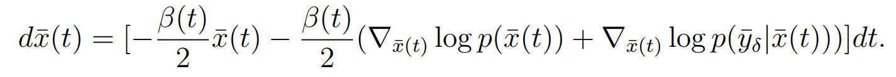

## 主要思路

由于DPS[Diffusion Posterior Sampling (DPS)](/docs/inverse/fwi/generative-models/Diffusion-Posterior-Sampling-DPS)在做反问题的时候，由于随机性的存在，稳定性不足，因此考虑将其SDE转化为ODE进行采样

# 详细总结

从DPS出发，理论上来说

连续意义下，该方程可以从一个近似噪声的分布，逐步返回到$x(0)\sim p(x(0)|\bar{y}_\delta)=\frac{p_{data}(x(0))p(y^\delta|x(0))}{p(y^\delta)}$的初始分布，其中$p_{data}(x(0))$为先验数据分布。

实际操作中，会引入如下误差

- 利用神经网络近似$\nabla_{\bar{x}(t)}\log p(\bar{x}(t))$的误差
- 利用数值近似计算$\nabla_{\bar{x}(t)}\log p(y^\delta|\bar{x}(t))$的误差
- 复杂算子求导时，会导致数值不稳定（如何避免？）。。。。。
- 离散误差（可通过增加步数来降低）
  - 实验验证[步长与稳定性](CyQ4w4wyZiv2enkNgJ3cyuWnnJf)

- 最终近似噪声分布与N(0,1)的误差（可通过增加步数来降低）

其中，前两项误差均会被离散误差放大。以下介绍SDE形式和ODE形式的区别。

## SDE

将$\nabla_{\bar{x}(t)}\log p(y^\delta|\bar{x}(t))$近似为二范数的梯度，这里存在一个Jensen gap。DPS原文中证明了，$E[f(x)]\sim f(Ex)$可以被bound住，然而，实际计算中利用的近似是：$\nabla_x E[f(x)]\sim \nabla_x f(Ex)$（这个似乎无法被bound住），而这个Jensen gap又会被离散化逐步放大，导致计算结果不准确。

## ODE

SDE到ODE的具体转化见[基于分数的生成方法（score-based）](/docs/inverse/fwi/generative-models/score-based)，转化完后代入条件信息，得到上式。

相较于SDE形式，ODE形式具有以下优点：

- Sample时具有较小的方差（相同初始噪声，得到的结果更稳定）
- 计算$\nabla_{\bar{x}(t)}\log p(y^\delta|\bar{x}(t))$时不需要借助Jensen来近似，可以通过确定性方程精确推导出初始时刻的估计$\hat{x}_0$，从而将近似误差转换为离散误差（同样可以靠增加步数解决）

### ODE问题

- 优点二的改进会引入大量的计算量，假设步数为n，采用精确近似会将计算量从O(n)变成O(n^2)
- 通过增加步数解决离散化误差后，采样时间会过长

以上两点均可尝试构建一个，从任何时刻，一步返回最初时刻的神经网络模型来解决。参考

[Consistency model.pdf](./assets/XLMFbWvStoZnwZxMeBJcunYCntb.pdf)

### 其他问题

- <b>如何改进复杂算子自动求导的数值不稳定情况？？？</b>
- 如何把数据信息方便的引入DPS方法（即模型可以添加一个外部数据接口，也可以不做任何添加的运行）？如何借鉴端到端的优势？（后话）
